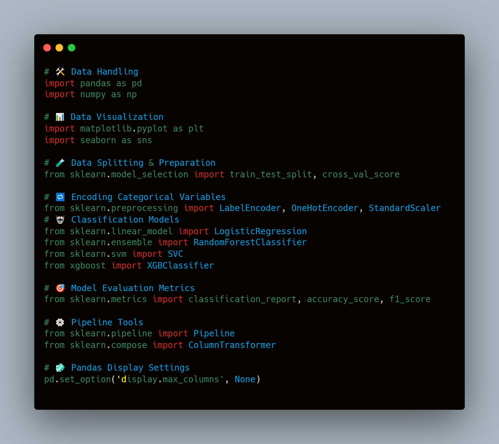

# 💻 Binary Classification on Imbalanced Dataset

This project focuses on solving a binary classification problem using various machine learning models.  
Since the dataset is imbalanced, the evaluation relies heavily on F1-score and additional metrics for better performance insight.

---

## 📁 Project Structure

```bash
project/
│
├── data/               # Dataset files (CSV or others)
├── notebook.ipynb      # Jupyter Notebook with code
├── README.md           # Project documentation
├── results/            # Exported results or figures
└── images/             # Screenshots for documentation
🧰 Libraries Used

import pandas as pd
import numpy as np
import matplotlib.pyplot as plt
import seaborn as sns
from sklearn.model_selection import train_test_split, cross_val_score
from sklearn.preprocessing import LabelEncoder, OneHotEncoder, StandardScaler
from sklearn.linear_model import LogisticRegression
from sklearn.ensemble import RandomForestClassifier
from sklearn.svm import SVC
from xgboost import XGBClassifier
from sklearn.metrics import classification_report, accuracy_score, f1_score, confusion_matrix
from sklearn.pipeline import Pipeline
from sklearn.compose import ColumnTransformer



📥 Dataset Loading and Exploration
Load dataset using pandas

Display basic info and initial rows


Descriptive Statistics


📈 Correlation Analysis
Compute and visualize the correlation matrix.


📊 Feature Distributions
Histograms of all numerical features


📊 Categorical Data Analysis
Count plots for Payment_Method


Count plots for Sale_Flag, Product_Gender, Category_Grouped


🚨 Outlier Detection
Identified outliers using statistical methods (e.g., IQR)


🧼 Missing Values & Cleaning
Dropped irrelevant column Family

Replaced nulls in Product_Gender with "UNISEX" for "Home" category

Standardized text data (lowercase, trimmed)


🧪 Model Training Pipeline
Applied preprocessing via ColumnTransformer

Trained 4 models:

Logistic Regression

Random Forest

SVM

XGBoost

Evaluated using Accuracy & F1 Score


📊 Model Performance Comparison
Bar plot comparing models based on Accuracy & F1 Score.


🔁 Cross-Validation
Used 3-fold cross-validation with F1 scoring to assess generalizability.


from sklearn.model_selection import cross_val_score
...
for model_name, model in models.items():
    pipeline = Pipeline([
        ("preprocessing", preprocessor),
        ("classifier", model)
    ])
    f1_scores = cross_val_score(pipeline, X, y, cv=3, scoring="f1")
    ...


🏆 Final Model & Exported Results
Selected XGBoost as final model.

Achieved highest accuracy and F1 score.

Exported predictions in CSV format for further analysis.


results_df = pd.DataFrame({
    "Actual": y_test,
    "Predicted": y_pred
})
results_df.to_csv("model_results.csv", index=False)
🚀 How to Run
Clone this repo

Install dependencies:


pip install -r requirements.txt
Open notebook.ipynb and run all cells.

📎 Notes
Dataset is highly imbalanced — hence, F1 Score is the main evaluation metric.

All categorical features were properly encoded.

Final model (XGBoost) is trained and ready for deployment or integration.

✨ Author
Major Khaled — Data Scientist 🚀
Project built with ❤️ and Python.
