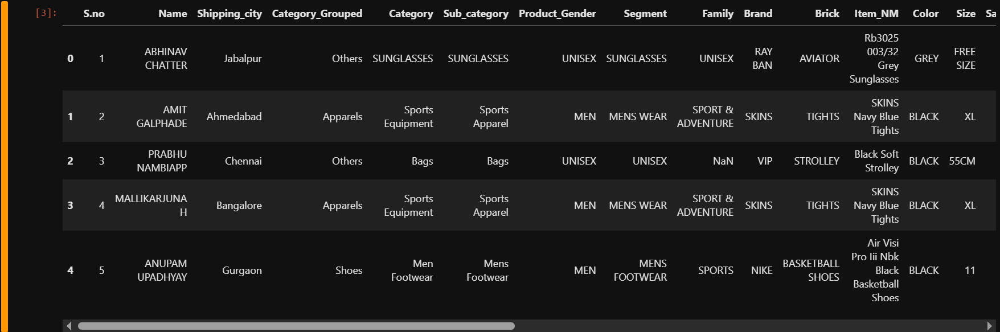

# 💻 Binary Classification on Imbalanced Dataset

This project focuses on solving a binary classification problem using various machine learning models.  
Since the dataset is imbalanced, the evaluation relies heavily on F1-score and additional metrics for better performance insight.

---

## 📁 Project Structure

```bash
project/
│
├── data/               # Dataset files (CSV or others)
├── notebook.ipynb      # Jupyter Notebook with code
├── README.md           # Project documentation
├── results/            # Exported results or figures
└── images/             # Screenshots for documentation
```

---

## 🧰 Libraries Used

```python
import pandas as pd  
import numpy as np  
import matplotlib.pyplot as plt  
import seaborn as sns  
from sklearn.model_selection import train_test_split, cross_val_score  
from sklearn.preprocessing import LabelEncoder, OneHotEncoder, StandardScaler  
from sklearn.linear_model import LogisticRegression  
from sklearn.ensemble import RandomForestClassifier  
from sklearn.svm import SVC  
from xgboost import XGBClassifier  
from sklearn.metrics import classification_report, accuracy_score, f1_score, confusion_matrix  
from sklearn.pipeline import Pipeline  
from sklearn.compose import ColumnTransformer  
```


---

## 📥 Dataset Loading and Exploration

```python
df = pd.read_csv("Paytm_Epurchase_data.csv")
df.head()
df.info()
df.describe()
```

  
  
  


---

## 📈 Correlation Analysis

Visualize relationships between numerical features.

```python
plt.figure(figsize=(12, 8))
sns.heatmap(df.corr(), annot=True, cmap='coolwarm')
plt.title('Correlation Heatmap')
plt.show()
```

  


---

## 📊 Feature Distributions

Histograms for numerical columns.

  


---

## 🚨 Outlier Detection

```python
# Example for IQR Method
Q1 = df['Item_Price'].quantile(0.25)
Q3 = df['Item_Price'].quantile(0.75)
IQR = Q3 - Q1
outliers = df[(df['Item_Price'] < Q1 - 1.5 * IQR) | (df['Item_Price'] > Q3 + 1.5 * IQR)]
```

  


---

## 🧪 Model Training Pipeline

```python
pipeline = Pipeline(steps=[
    ('preprocessor', preprocessor),
    ('classifier', model)
])
pipeline.fit(X_train, y_train)
```

  


---

## 📊 Model Accuracy & Comparison

```python
# Plot Accuracy & F1-Score for each model
plt.bar(model_names, accuracy_scores)
plt.title("Model Accuracy")
```


---

## 🔁 Cross Validation

```python
for model_name, model in models.items():
    pipeline = Pipeline([
        ("preprocessing", preprocessor),
        ("classifier", model)
    ])
    f1_scores = cross_val_score(pipeline, X, y, cv=3, scoring="f1")
```

  


---

## 🧾 Final Model Evaluation

```python
from sklearn.metrics import accuracy_score, confusion_matrix, classification_report

y_pred = final_model.predict(X_test_processed)

print("Accuracy:", accuracy_score(y_test, y_pred))
print("Confusion Matrix:\n", confusion_matrix(y_test, y_pred))
print("Classification Report:\n", classification_report(y_test, y_pred))
```


---

## 🏆 Final Model & Exported Results

- Final model: **XGBoost**
- Highest performance in terms of F1-score and accuracy.
- Predictions exported for business use:

```python
results_df = pd.DataFrame({
    "Actual": y_test,
    "Predicted": y_pred
})
results_df.to_csv("model_results.csv", index=False)
```

---

## 🚀 How to Run

1. Clone this repo.
2. Install dependencies:

```bash
pip install -r requirements.txt
```

3. Open `notebook.ipynb` and run all cells.

---

## 📎 Notes

- Dataset is highly imbalanced → **F1 Score** was the main evaluation metric.
- All categorical features were encoded.
- Final model is ready for deployment 🚀

---

## ✨ Author

**Major Khaled** — Data Scientist 🚀  
Project built with ❤️ and Python.